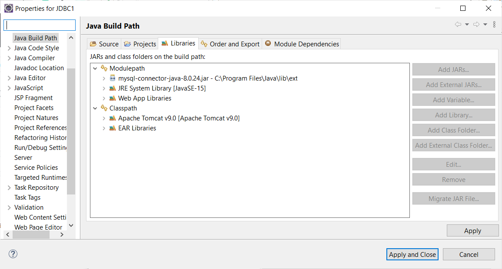
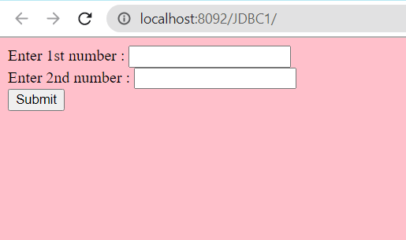
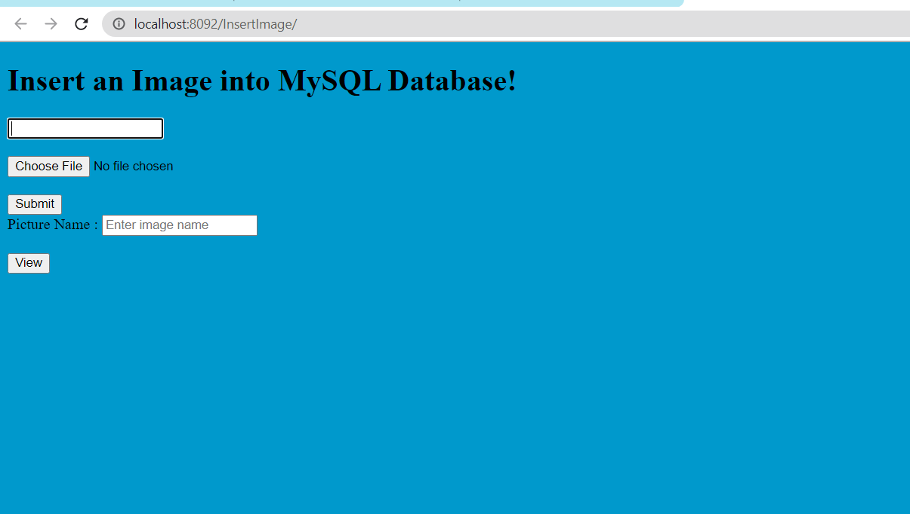

# Java-Advance

## Steps to run the above JDBC Statements program in Eclipse
- Create new Dynamic Web Project
- Right click on the project folder and then select build path < Configure Build path
- After selecting configure build path
  - You will see this window
  - 
- Then click on Add external jars to connect mysql connector with the project
- At last click Apply and close the window
I have provided the important files to run the project. You can simply use the servlet and html files in your project.

### Statement

### PreparedStatement

